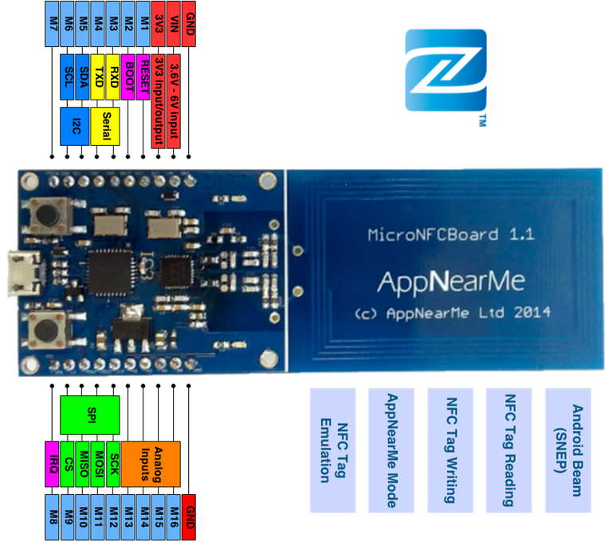

### Start with PolyMCU Framework

PolyMCU is an open-source framework for micro-controller. The framework is only based on existing and mature open-source components.

#### On Linux

1. Clone the Github repository
```
git clone https://github.com/labapart/polymcu.git
cd polymcu
```

2. Set `CROSS_COMPILE` environment variable with your ARM GNU Toolchain. Example:
```
export CROSS_COMPILE=~/Toolchains/gcc-arm-none-eabi-4_9-2014q4/bin/arm-none-eabi-
```

3. Create the build directory
```
mkdir Build && cd Build
```

4. Build the firmware
```
cmake -DBOARD=AppNearMe/MicroNFCBoard -DAPPLICATION=Examples/Baremetal ..
make
```

5. If the MicroNFCBoard is into the built-in USB programming mode (ie: the board appears as `CRP DISABLD` on your host machine) then you can install the newly build firmware with:
```
make install
```

#### On Windows

##### Requirements
- Install CMake: https://cmake.org/download/ 
- Install the latest GCC v4.9 2015q3 for ARM Cortex M: https://launchpad.net/gcc-arm-embedded/4.9/4.9-2015-q3-update/+download/gcc-arm-none-eabi-4_9-2015q3-20150921-win32.zip 
- Install MinGW: http://sourceforge.net/projects/mingw/files/Installer/mingw-get-setup.exe/download (mingw32-base, mingw32-gcc-g++)

##### Build

1. Download the latest sources of PolyMCU at https://github.com/labapart/polymcu/archive/master.zip

2. Un-archive `master.zip`

3. Start a command line shell (ie: `cmd.exe`)

4. Add CMake and MinGW to your `PATH` if it is not already done. For instance:
```
SET PATH="c:\Program Files (x86)\CMake\bin";%PATH%
SET PATH=C:\MinGW\bin;%PATH%
```

5. Add your toolchain into the `CROSS_COMPILE`. For instance:
```
SET CROSS_COMPILE=c:\Users\Olivier\gcc-arm-none-eabi-4_9-2015q3-20150921-win32\bin\arm-none-eabi-
```

6. Create the `Build` directory into PolyMCU root
```
cd <PolyMCU Root>
mkdir Build
cd Build
```

7. **[Optional]** To build with LLVM
```
set PATH="C:\Program Files (x86)\LLVM\bin";%PATH%
set CC=clang.exe
```

8. Build the project
```
cmake -G "MinGW Makefiles" -DAPPLICATION=Examples/Baremetal -DBOARD=AppNearMe/MicroNFCBoard ..
mingw32-make
```

### Set the board in built-in USB programming mode

1. hold the Bootloader button (right button)
2. while pressing the Bootloader button press the Reset button (left button) and then release it.
3. release the Bootloader button

The board should appear as an USB mass storage device with the label `CRP DISABLD`.

### Install the Windows Serial Driver

1. Download the driver at http://dev.appnearme.com/static/micronfcboard/drivers/micronfcboard_serial.inf
2. Plug the MicroNFCBoard to your Windows host machine. 
   Windows will try to find an existing driver for it without success
3. Open the Windows Device Manager to find the non recognized device
    - Right click on the device >
    - Update driver software
    - Click on "Browse my computer for driver software"
    - Indicate the path where you downloaded micronfcboard_serial.inf
    - Accept the warning message

### MicroNFCBoard hardware

The board uses NXP LPC11U34FHN33/421 (ARM Cortex-M0).



* `LPC_SSP0` is exposed to the MicroNFCBoard pin 9-12.
* `LPC_SSP1` is connected to NXP PN512.
* GPIO@M9 (SPI_CS) is PIO0_2.

To redirect `printf` output through the UART/Serial port instead of using UART-over-USB rebuild your application with the CMake parameters `-DSUPPORT_DEVICE_USB=0 -DDEBUG_UART_BAUDRATE=9600` (eg: use a baudrate of 9600).

### Status

- CMSIS RTOS example does not work (yet) on the board
